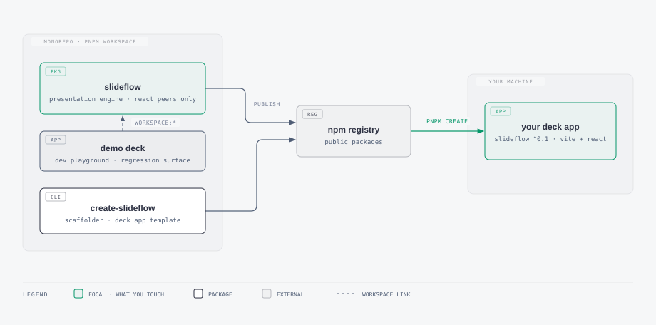
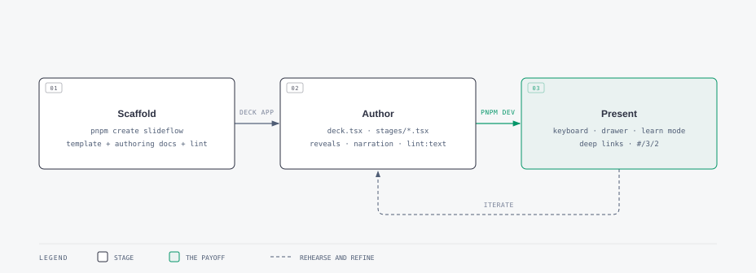

<p align="center">
  <picture>
    <source media="(prefers-color-scheme: dark)" srcset=".github/assets/logo-dark.svg">
    
  </picture>
</p>

<p align="center">
  A router-agnostic presentation engine for React — progressive reveals, present and learn modes,<br>
  an explain drawer, and URL-addressable slides, with only <code>react</code> and <code>react-dom</code> as peers.
</p>

<p align="center">
  <a href="LICENSE"></a>
  
  
</p>

---

SlideFlow exists so slide decks stop being copy-pasted between projects. The engine ships as one npm package with a self-contained stylesheet; each talk is its own small Vite app that installs it. Fix something in the engine once, and every deck picks it up with a version bump.

## How the pieces fit

<picture>
  <source media="(prefers-color-scheme: dark)" srcset=".github/assets/architecture-dark.svg">
  
</picture>

Two packages leave this repo:

- **`slideflow`** — the engine. A `<Deck>` component with keyboard navigation, CSS-only reveal and cross-fade animation, a per-slide explain drawer, a learn mode that shows everything for readers, and a hash-based URL contract so every slide and step is deep-linkable. Theming is CSS custom properties (`--sf-*`); no styling dependencies.
- **`create-slideflow`** — the scaffolder. One command generates a ready-to-run deck app: engine installed, two example slides (watermarked so they can never sneak into a real talk), authoring standards, and a writing lint.

## From zero to on stage

```bash
pnpm create slideflow my-talk
cd my-talk && pnpm install && pnpm dev
```

<picture>
  <source media="(prefers-color-scheme: dark)" srcset=".github/assets/lifecycle-dark.svg">
  
</picture>

Authoring is plain TypeScript and JSX: a `deck.tsx` manifest lists slides, each slide is a React component receiving a stage context, and `<Reveal ctx={ctx} at={n}>` paces content one idea at a time. The full API — keyboard map, modes, URL contract, theming tokens — lives in [`packages/slideflow/README.md`](packages/slideflow/README.md).

## Repo structure

```
SlideFlow/
├── packages/
│   ├── slideflow/              # engine package → npm
│   │   ├── src/
│   │   │   ├── index.ts        # exports: Deck, Reveal, useDeck, DeckProvider, useStageContext, createHashAdapter, types
│   │   │   ├── types.ts        # Slide, DeckModel, StageContext, Mode, Narration
│   │   │   ├── DeckContext.tsx # nav state, URL sync, learn-mode pin
│   │   │   ├── Deck.tsx        # chrome, keyboard, explain drawer, cross-fade
│   │   │   ├── Reveal.tsx      # CSS-only reveal primitive
│   │   │   ├── NavHelp.tsx     # help modal (focus mgmt, key swallowing)
│   │   │   ├── url.ts          # hash UrlAdapter, the URL contract
│   │   │   ├── cx.ts           # tiny classnames join
│   │   │   └── inert.ts        # inert polyfill (React 18/19 aware)
│   │   ├── styles.css          # chrome + reveal/cross-fade animations, token-driven
│   │   └── theme.css           # default dark palette (optional import)
│   └── create-slideflow/       # scaffolder → npm
│       ├── index.mjs           # bin: prompts → copy template + string replace
│       ├── lib.mjs             # scaffold(): copy template, replace tokens
│       └── template/           # full deck app skeleton
├── demo/                       # workspace app: demo deck, dev playground
├── docs/authoring/             # canonical deck-standard, writing-rules, tone-of-voice
├── scripts/check-text.mjs      # canonical text lint
└── pnpm-workspace.yaml
```

## Developing

```bash
pnpm install                        # install the whole workspace
pnpm test                           # run every package's test suite
pnpm --filter slideflow-demo dev    # run the demo deck locally
```

The `demo/` app consumes `slideflow` via `workspace:*` and exercises every engine feature — multi-step reveals, the explain drawer, learn mode, cross-fade, act labels, the help modal. It is the fastest way to see a change working and doubles as the manual regression check before a release.

`docs/authoring/` and `scripts/check-text.mjs` are the canonical source for authoring standards and the text lint. The demo references them directly; `create-slideflow`'s template — which ships standalone to consumers — gets its own copy via `pnpm sync:authoring`, also run automatically on `prepack`.

## Releasing

Publishing is manual and simple for v1 — no changesets, no CI:

1. Bump the version in `packages/slideflow/package.json` and `packages/create-slideflow/package.json`.
2. Run `pnpm sync:authoring` so the scaffolder's template ships the current authoring docs and text lint.
3. Run `pnpm -r publish` from the repo root — from `main`, with a clean working tree: pnpm's git checks reject uncommitted or untracked files and prompt for confirmation on any other branch, so pass `--no-git-checks` explicitly if you need to publish outside that state.

## Integrating with a host app that has its own router

The built-in hash sync (`#/<index>`, with `/<step>` appended once step > 0, plus `?mode=learn`) works with zero configuration, but a host app that already owns the address bar can hand `Deck` a `urlAdapter` to read and write its own routes instead, and an `onExit` callback for what happens when the last Escape press leaves the deck:

```tsx
<Deck
  deck={myDeck}
  urlAdapter={{ read: readFromRoute, write: writeToRoute, subscribe: onRouteChange }}
  onExit={() => navigate("/presentation")} />
```

See [`packages/slideflow/README.md`](packages/slideflow/README.md) for the full `urlAdapter`/`onExit` contract and the rest of the engine's public API.

## License

MIT
